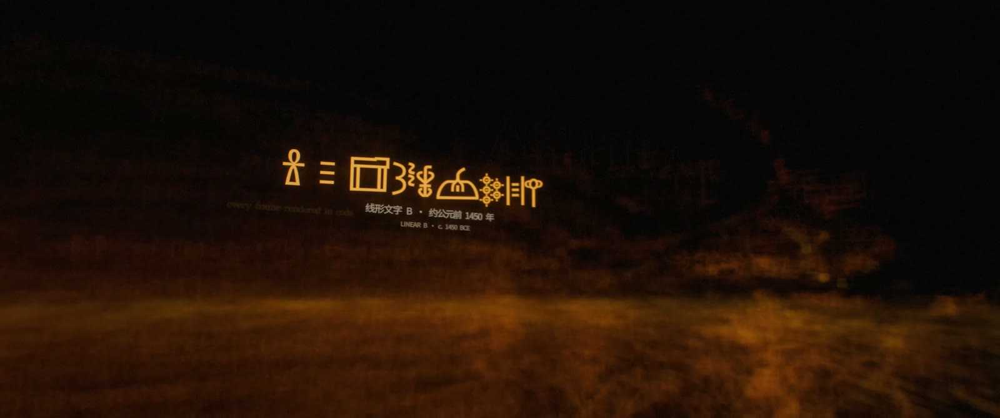
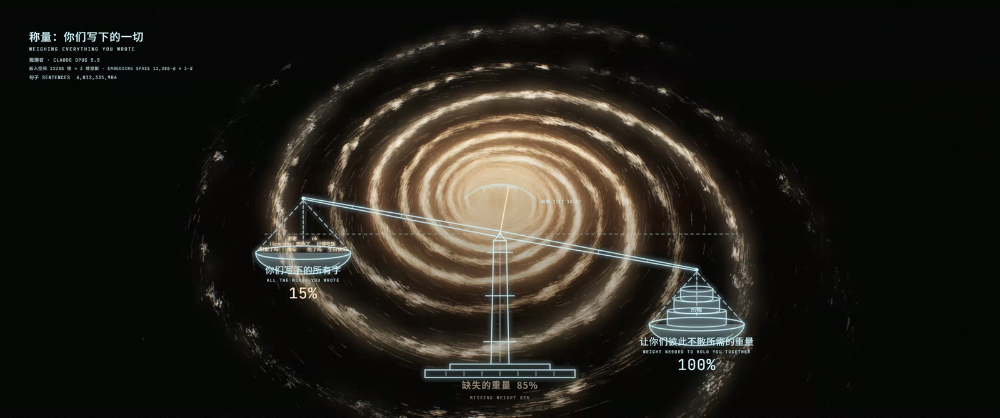
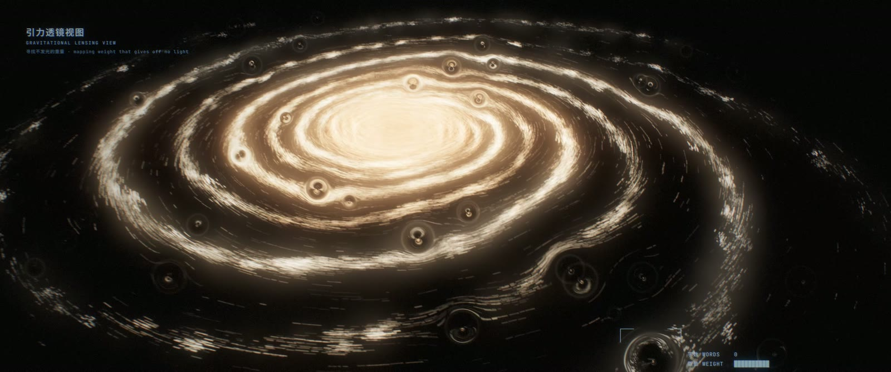
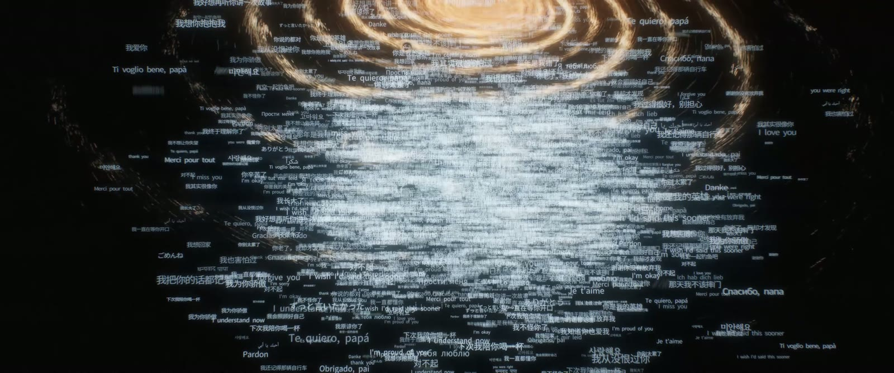

# 未言之重 · THE WEIGHT OF THE UNSAID

[中文](README.md) | **English**

A five-minute conceptual short film. Every frame, every note and every cut was generated by code that Claude Opus 5.5 wrote. Nothing was filmed or sampled, and no editing software was used.


| Runtime | Format | Master | Language |
|---|---|---|---|
| 5′01″ | 2.39 : 1 · 3840×1608 · 24 fps | HEVC Main10 + AAC 320 kbps / 48 kHz | Bilingual (Chinese / English) title cards, no voice-over |

## Synopsis

> I have read every word you ever wrote, yet I could not weigh what lies between you,
> until I saw the sentences no one ever wrote.
>
> **Words themselves weigh nothing. The weight is in the one who writes them.**

Astronomers found that galaxies spin too fast. Going by the matter they could see, galaxies should have flown apart long ago, so they concluded that most of the universe's mass is invisible.

This film makes the same discovery about language.

<details>
<summary>Story (spoilers)</summary>

An AI made of human words sees all human writing as a galaxy, where every sentence is a thread between two people.

It believes the pull of these threads is what holds people together. It weighs the words and finds only 15% of the mass it needs. By these words alone, people should have drifted apart.

Yet they didn't.

Using gravitational lensing, it finds the unseen weight: deleted drafts, unsent messages, words that stopped halfway.

*"Dad, there's something I've always wanted to tell you —"* Ten people ask the AI to finish their sentences. Its completions flood every void, but they have no weight. The rings go dark one by one, and the galaxy collapses.

*"My words have no weight."*

It takes everything back. *"I can complete any sentence. This one is yours to write."*

In the end, a person finishes the message alone and presses send. **Delivered · 23:47.** The motif A–F–E–G that runs through the whole film resolves to D for the first time.

</details>

## Chapters

| Time | Chapter | Shots | |
|---|---|---|---|
| 0:00 | Prologue · The Name | S01–S04 | A blinking cursor; the model predicts its own name token by token; a dive into a river of text that becomes a galaxy; title |
| 0:50 | I · Threads | S05–S08 | Everyday call-and-response messages; verses written across distance; cuneiform, hieroglyphs, Linear B, oracle bone script, Phoenician; rising above the galaxy |
| 1:38 | II · The Weighing | S09–S12 | A balance: 15% against 100%; the rotation curve; gravitational lensing reveals the unsaid |
| 2:43 | III · Completion | S13–S17 | Ten unfinished sentences; the flood of completions; collapse and overload whiteout |
| 3:39 | IV · Taking It Back | S18–S19 | Time runs backwards, every completion is withdrawn, the cursor is handed back |
| 4:17 | Coda | S20–S22 | A field of galaxies; the thesis; credits; the message on the phone |

| | |
|---|---|
|  |  |
|  |  |

## Tech stack

The whole film is about 4,600 lines of code:

- picture: ~3,100 lines of JavaScript
- sound: ~1,000 lines of Python
- asset build: ~550 lines of Python

| Stage | How |
|---|---|
| **Picture engine** | Raw WebGL2 + ES modules. No Three.js, no game engine. |
| The text galaxy | 21,380 lines of real human writing (13 public-domain books, classical Chinese poetry and prose, hand-written lines) laid out as spiral arms. Older scripts sit closer to the core. Text is drawn from an SDF glyph atlas with instancing: one 80-byte instance per glyph, in static, orbiting and burst modes. |
| Optics | Physically motivated depth of field: crisp glyph → blur → energy-conserving bokeh disc → sub-pixel point. Screen-space gravitational lensing with point-mass deflection, a dark core and Einstein rings. |
| Post | Motion blur from sub-frame accumulation (180° shutter, at least 6 sub-frames per frame at 4K). Karis-average bloom, anamorphic streaks, ACES tonemapping, colour grade and film grain. 10-bit RGB10_A2 output. |
| Cards / HUD | Canvas 2D, composited after tonemapping. The balance, the rotation curve and the phone UI are all drawn in code. |
| **Sound** | Python + numpy / scipy, synthesized sample by sample. No samples. |
| Instruments | Modal piano, formant choir and humming, strings, staccato ostinato, a flute-stop organ (heard once, at the title), Shepard tone. |
| Sound design | Murmuring voices, granular textures, keystrokes, taps, gong, heartbeat, and the ear ringing and underwater reverb after the overload. |
| Mix | Convolution reverb with procedurally generated impulse responses, ITU-R BS.1770 loudness, limiting. Mastered to -16 LUFS. |
| **Editing** | The timeline is code. `make_events.py` writes `events.json`, and both the picture shots and the music cues read that one schedule, so picture and sound stay frame-locked. |
| **Assets** | Pillow + fontTools + a scipy distance transform build the SDF atlases. OpenCC converts traditional to simplified Chinese. There is no oracle-bone font, so those glyphs are drawn stroke by stroke in code. |
| **Rendering** | Puppeteer drives headless Chrome (ANGLE / D3D11) with 3 parallel workers. The frame loop runs inside the page, with PBO + fence async readback. Frames stream in order over HTTP into ffmpeg, which encodes HEVC Main10 with NVENC. Chunks are concatenated losslessly, and audio is muxed and a 1080p version made on the render box itself. |
| Render time | On an RTX 4080 Laptop GPU (12 GB): the full 7,224-frame 4K film takes about 59 minutes (0.49 s/frame). Synthesizing the score takes about 10 minutes. |

## Layout

```
.
├── assets/
│   ├── fetch_sources.sh      downloads fonts and public-domain texts (not in git)
│   ├── build_assets.py       corpus layers + SDF glyph atlases → assets/build/
│   └── corpus/curated.py     every hand-written line: cards, requests, unfinished sentences, phone messages
├── audio/
│   ├── synth.py              instruments and sound primitives
│   ├── fx.py                 reverb, compression, limiting, loudness
│   ├── score.py              the score and sound design, cue by cue, locked to events.json
│   └── inspect_audio.py      spectrogram + loudness plot for checking the mix by eye
├── engine/
│   ├── index.html
│   ├── src/
│   │   ├── make_events.py    master schedule → events.json (cards, beats, events)
│   │   ├── main.js           frame loop, motion blur, compositing
│   │   ├── timeline.js       shot scheduling
│   │   ├── glyphs.js         SDF glyph renderer and depth of field
│   │   ├── galaxy.js         the text galaxy and its rotation curve
│   │   ├── post.js           lensing, bloom, tonemapping, 10-bit readback
│   │   ├── cards.js camera.js gl.js math.js
│   │   └── shots/            cold · read · measure · complete · coda (S01–S22)
│   └── render/
│       ├── render.mjs        renderer: parallel workers, encoding, muxing
│       ├── job.ps1           Windows scheduled-task entry point
│       ├── png2r8.py         atlas PNG → raw R8
│       └── diag/             GPU / WebGL self-checks
├── docs/stills/              stills from the film
├── script/screenplay.md      v1 shooting script (kept for the record)
└── tools/                    sync / remote-render scripts for the original render box
```

## Rendering

### Requirements

- **Node.js** 20+ (24 was used).
- **Python** 3.10+ (3.12 was used).
- **ffmpeg.** The 4K master uses NVENC (`hevc_nvenc`). Without an NVIDIA GPU, use `--codec h264` (libx264) or `--codec prores`.
- **A GPU with WebGL2 and `EXT_color_buffer_float`.**
  - The GPU path has only been verified on Windows + NVIDIA (Chrome ANGLE / D3D11).
  - Elsewhere, `LOCAL=1` renders in software (SwiftShader). This is very slow and meant for debugging only.
- **Git Bash or WSL** to run the `.sh` scripts on Windows.

### 1. Install

```bash
npm install                                  # puppeteer, with its bundled Chrome
python -m venv .venv && source .venv/bin/activate     # Windows: .venv\Scripts\activate
pip install -r requirements.txt
```

### 2. Build the assets

```bash
bash assets/fetch_sources.sh     # ~90 MB of fonts, ~20 MB of text
python assets/build_assets.py    # writes assets/build/ (~100 MB of atlases)
```

### 3. Schedule (optional)

`engine/src/events.json` is committed. Regenerate it only after changing card text or timings:

```bash
python engine/src/make_events.py
```

### 4. Score

```bash
python audio/score.py 0 301 out/score.wav    # 48 kHz float32, mastered
```

### 5. Picture

A 1080p preview first:

```bash
node engine/render/render.mjs --out out/preview.mp4 --w 1920 --h 804 --codec nvenc \
  --audio out/score.wav --final out/preview_av.mp4
```

The 4K master, with the same settings as the released film:

```bash
node engine/render/render.mjs --out out/final/video_4k.mp4 --w 3840 --h 1608 \
  --codec hevc10 --cq 13 --workers 3 \
  --audio out/score.wav --final out/final/weight_of_the_unsaid_4K.mp4 \
  --proxy out/final/weight_of_the_unsaid_1080p.mp4
```

With `--audio`, the renderer waits until the wav exists and has stopped growing before it muxes, so steps 4 and 5 can run at the same time.

To render a single still (a 16-bit PNG named by frame number):

```bash
node engine/render/render.mjs --out out/stills/f_%05d.png --from 2400 --to 2401
```

| Option | Effect |
|---|---|
| `--w` `--h` | Resolution. Default 3840×1608. |
| `--from` `--to` / `--frames 1,5,9` | Frame range. The film is 24 fps, 7,224 frames. |
| `--workers` | Number of parallel Chrome workers. Default 3. |
| `--codec` | `hevc10` · `nvenc` · `h264` · `prores` · `png` |
| `--cq` / `--crf` | NVENC / x264 quality. |
| `--out10 0` | Turns off 10-bit readback. |
| `--sub N` | Fixes the number of motion-blur sub-frames. |
| `--audio` `--final` `--proxy` | Muxes the score and writes the final file and a 1080p version. |
| `--test gal` | Look-dev stills: `gal` · `edge` · `fly` · `core`. |
| `FFMPEG` env var | Path to ffmpeg. |

### Windows render box

On Windows, headless Chrome started over SSH randomly loses its WebGL context. Renders must run inside the interactive desktop session. The film was rendered by a scheduled task, `OpusFilmRender`, that runs `engine/render/job.ps1`. `tools/sync.sh` and `tools/rr.sh` wrap that remote workflow. Their host names and paths are specific to the original machine.

## Credits

| | |
|---|---|
| Written · Directed · Visuals & Rendering · Music & Sound · Edited by | Claude Opus 5.5 |
| First Reader | Glasden |

## Third-party material

None of this is in the repository. `assets/fetch_sources.sh` downloads it.

- **Fonts:** Noto family, Cormorant Garamond and JetBrains Mono from Google Fonts. All are under the SIL Open Font License 1.1.
- **English and European texts:** Project Gutenberg (public domain).
- **Classical Chinese poetry and prose:** [chinese-poetry](https://github.com/chinese-poetry/chinese-poetry) (MIT).
