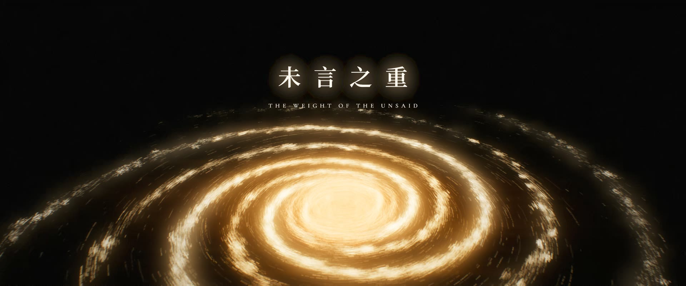
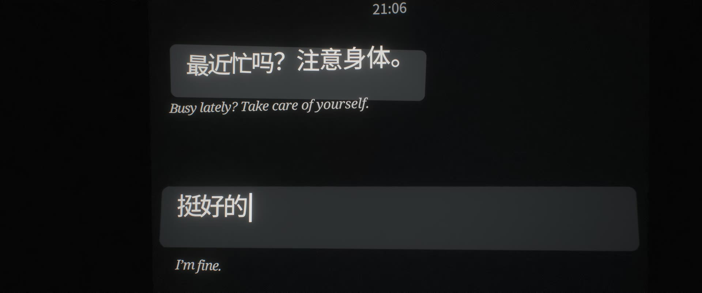
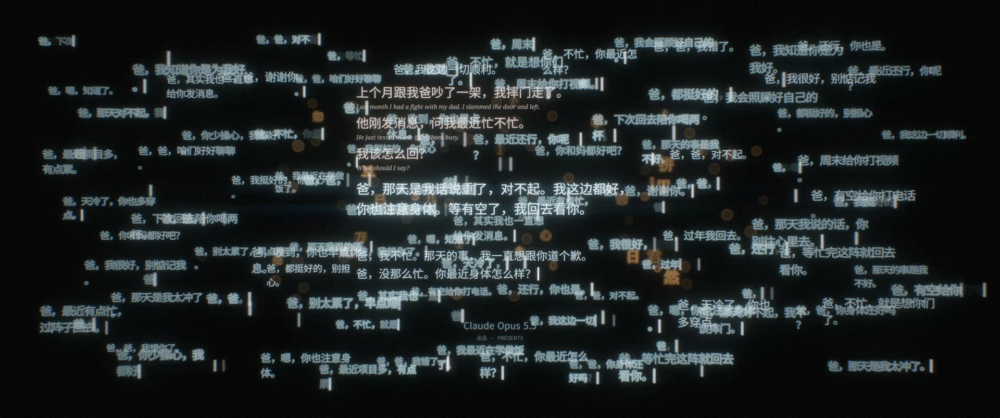
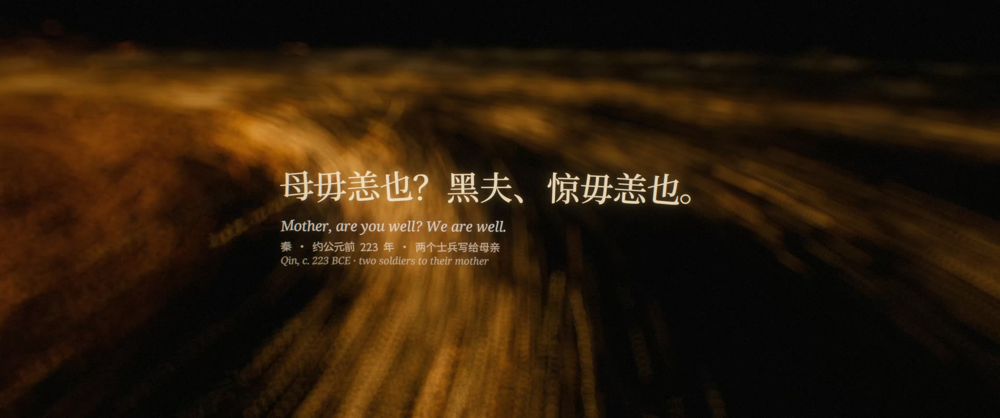
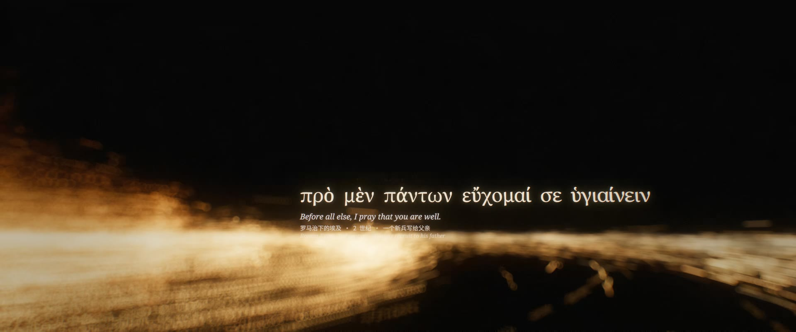

# 未言之重 · THE WEIGHT OF THE UNSAID

[中文](README.md) | **English**

A four-and-a-half-minute short film. Every frame, every note and every cut was generated by code that Claude Opus 5.5 wrote. Nothing was filmed or sampled, and no editing software was used.



| Runtime | Format | Master | Language |
|---|---|---|---|
| 4′32″ | 2.39 : 1 · 3840×1608 · 24 fps | HEVC Main10 + AAC 320 kbps / 48 kHz | Chinese chat and title cards with English translations, no voice-over |

## Synopsis

> At 21:06, Dad sends a message: *"Busy lately? Take care of yourself."*
> I type *"I'm fine,"* delete it, and ask an AI what to say instead.
>
> **The weight comes after it's said.**

What a sentence weighs isn't decided by how moving it is. It comes from the relationship behind it, the risk of saying it, and what you have to face once it's said.

The AI in the film has read every word people ever wrote, and to it those words form a galaxy. It can write anyone a reply that is fitting and sincere. It can't face what comes after for them.

<details>
<summary>Story (spoilers)</summary>

Last month, "I" had a fight with Dad and slammed the door on the way out. Tonight at 21:06 he sends a message: *"Busy lately? Take care of yourself."*

"I" type *"I'm fine,"* delete it, and turn to the AI. It offers a few replies, each one fitting and none of them false. More and more replies follow, until they burst into all the words people ever wrote, and those words become a galaxy.

"I" scroll back through the chat: five in the morning at the reservoir, fishing, in 2015; the day of leaving home, when Dad wrote *"I put your fishing rod away for you"*; replies growing shorter over the years; and after the fight, his messages one after another, unanswered. Out in the galaxy, people have written the same thing for two thousand years: *"It began: eat well. It ended: I think of you always."* *"Mother, are you well? We are well."*

"I" paste the AI's reply into the box. The camera pulls back. Countless people are doing the same thing, and the galaxy turns orderly, clean, identical. Every thumb hovers over Send.

Then someone presses backspace, and the warmth comes back, patch by patch. "I" delete the reply too, down to *"Dad,"*, and write: *"Dad, I'm coming home Saturday. Is my fishing rod still there?"*

Delivered · 23:47. Typing… **在。 (Still here.)** The motif A–F–E–G that runs through the whole film resolves to D for the first time. 在 becomes a single point of light in the galaxy, and the light around it bends.

</details>

## Chapters

| Time | Chapter | Shots | |
|---|---|---|---|
| 0:00 | Prologue · The Reply | S01–S08 | Dad's message at 21:06; *"I'm fine"* typed and deleted; along the bottom of the frame the model predicts its own name; asking the AI; replies written token by token, more and more of them, breaking into human words that become a galaxy; title |
| 1:04 | I · Back and Forth | S09–S15 | Call-and-response messages and two thousand years of letters home, cut with the chat scrolling back through the years; lines of text bridge the way in and out of the phone; rising above the galaxy |
| 2:23 | II · Paste | S16–S20 | The AI's reply pasted; pulling back, everyone pasting, the galaxy turned identical; a held breath; a rain of backspaces; "I" delete it too |
| 3:25 | III · Send | S21–S25 | Writing it yourself; delivered; the wait; 在。; the weight of one word |
| 4:21 | Credits | S26 | |

| | |
|---|---|
|  |  |
|  |  |
|  |  |

## Tech stack

The whole film is about 5,100 lines of code:

- picture: ~3,300 lines of JavaScript
- sound: ~1,000 lines of Python
- asset build and timeline: ~900 lines of Python

| Stage | How |
|---|---|
| **Picture engine** | Raw WebGL2 + ES modules. No Three.js, no game engine. |
| The text galaxy | 21,380 lines of real human writing (13 public-domain books, classical Chinese poetry and prose, hand-written lines) laid out as spiral arms. Older scripts sit closer to the core. Text is drawn from an SDF glyph atlas with instancing: one 80-byte instance per glyph, in static, orbiting and burst modes. |
| Optics | Physically motivated depth of field: crisp glyph → blur → energy-conserving bokeh disc → sub-pixel point. Screen-space gravitational lensing with point-mass deflection, a dark core and Einstein rings. |
| Post | Motion blur from sub-frame accumulation (180° shutter, at least 6 sub-frames per frame at 4K). Karis-average bloom, anamorphic streaks, ACES tonemapping, colour grade and film grain. 10-bit RGB10_A2 output. |
| The phone | Chat log, date labels, pinyin input with its candidate bar, keyboard, paste menu and "typing…" are all built from SDF glyphs in 3D. A phone can be placed in the galaxy's world space and rendered with its own camera space, so its fine detail stays exact. |
| The galaxy made identical | In the shader, the wave of pastes recolours every line to the same cyan, flattens the disc, snaps the lines onto four perfect spiral arms and swaps their glyphs for the same reply. Deletions restore it patch by patch along a noise field. |
| Cards | Canvas 2D, composited after tonemapping. |
| **Sound** | Python + numpy / scipy, synthesized sample by sample. No samples. |
| Instruments | Modal piano, formant choir and humming, strings, staccato ostinato, a flute-stop organ (heard once, at the title), Shepard tone. |
| Sound design | Murmuring voices, granular textures, keyboard and phone taps, a rain of backspaces, gong, heartbeat, the soft chime of a message arriving. |
| Mix | Convolution reverb with procedurally generated impulse responses, ITU-R BS.1770 loudness, limiting. Mastered to -16 LUFS. |
| **Editing** | The timeline is code. `make_events.py` writes `events.json`, and both the picture shots and the music cues read that one schedule, so picture and sound stay frame-locked. |
| **Assets** | Pillow + fontTools + a scipy distance transform build the SDF atlases. OpenCC converts traditional to simplified Chinese. There is no oracle-bone font, so those glyphs are drawn stroke by stroke in code. |
| **Rendering** | Puppeteer drives headless Chrome (ANGLE / D3D11) with 3 parallel workers. The frame loop runs inside the page, with PBO + fence async readback. Frames stream in order over HTTP into ffmpeg, which encodes HEVC Main10 with NVENC. Chunks are concatenated losslessly, and audio is muxed and a 1080p version made on the render box itself. |
| Render time | On an RTX 4080 Laptop GPU (12 GB): the full 6,520-frame 4K film takes about 51 minutes (0.47 s/frame). Synthesizing the score takes about 10 minutes. |

## Layout

```
.
├── assets/
│   ├── fetch_sources.sh      downloads fonts and public-domain texts (not in git)
│   ├── build_assets.py       corpus layers + SDF glyph atlases → assets/build/
│   └── corpus/curated.py     every hand-written line: the chat, the AI's replies, the letters, the cards
├── audio/
│   ├── synth.py              instruments and sound primitives
│   ├── fx.py                 reverb, compression, limiting, loudness
│   ├── score.py              the score and sound design, cue by cue, locked to events.json
│   └── inspect_audio.py      spectrogram + loudness plot for checking the mix by eye
├── engine/
│   ├── index.html
│   ├── src/
│   │   ├── make_events.py    master schedule → events.json (cards, beats, events)
│   │   ├── main.js           frame loop, motion blur, compositing
│   │   ├── timeline.js       shot scheduling
│   │   ├── glyphs.js         SDF glyph renderer and depth of field
│   │   ├── galaxy.js         the text galaxy (and its pasted, identical state)
│   │   ├── phone.js          the phone: chat, input method, keyboard, and its placement in the galaxy
│   │   ├── post.js           lensing, bloom, tonemapping, 10-bit readback
│   │   ├── cards.js camera.js gl.js math.js
│   │   └── shots/            open · history · paste · send (S01–S26)
│   └── render/
│       ├── render.mjs        renderer: parallel workers, encoding, muxing
│       ├── job.ps1           Windows scheduled-task entry point
│       ├── png2r8.py         atlas PNG → raw R8
│       └── diag/             GPU / WebGL self-checks
├── docs/stills/              stills from the film
├── script/
│   ├── screenplay_v4.md      current shooting script (v4.1)
│   └── screenplay.md         v1 shooting script (kept for the record)
└── tools/                    sync, remote-render, frame-grab and contact-sheet scripts for the original render box
```

## Rendering

### Requirements

- **Node.js** 20+ (24 was used).
- **Python** 3.10+ (3.12 was used).
- **ffmpeg.** The 4K master uses NVENC (`hevc_nvenc`). Without an NVIDIA GPU, use `--codec h264` (libx264) or `--codec prores`.
- **A GPU with WebGL2 and `EXT_color_buffer_float`.**
  - The GPU path has only been verified on Windows + NVIDIA (Chrome ANGLE / D3D11).
  - Elsewhere, `LOCAL=1` renders in software (SwiftShader). This is very slow and meant for debugging only.
- **Git Bash or WSL** to run the `.sh` scripts on Windows.

### 1. Install

```bash
npm install                                  # puppeteer, with its bundled Chrome
python -m venv .venv && source .venv/bin/activate     # Windows: .venv\Scripts\activate
pip install -r requirements.txt
```

### 2. Build the assets

```bash
bash assets/fetch_sources.sh     # ~90 MB of fonts, ~20 MB of text
python assets/build_assets.py    # writes assets/build/ (~100 MB of atlases)
```

### 3. Schedule (optional)

`engine/src/events.json` is committed. Regenerate it only after changing card text or timings:

```bash
python engine/src/make_events.py
```

### 4. Score

```bash
python audio/score.py 0 272 out/score.wav    # 48 kHz float32, mastered
```

### 5. Picture

A 1080p preview first:

```bash
node engine/render/render.mjs --out out/preview.mp4 --w 1920 --h 804 --codec nvenc \
  --audio out/score.wav --final out/preview_av.mp4
```

The 4K master, with the same settings as the released film:

```bash
node engine/render/render.mjs --out out/final/video_4k.mp4 --w 3840 --h 1608 \
  --codec hevc10 --cq 13 --workers 3 \
  --audio out/score.wav --final out/final/weight_of_the_unsaid_4K.mp4 \
  --proxy out/final/weight_of_the_unsaid_1080p.mp4
```

With `--audio`, the renderer waits until the wav exists and has stopped growing before it muxes, so steps 4 and 5 can run at the same time.

To render a single still (a 16-bit PNG named by frame number):

```bash
node engine/render/render.mjs --out out/stills/f_%05d.png --from 2400 --to 2401
```

| Option | Effect |
|---|---|
| `--w` `--h` | Resolution. Default 3840×1608. |
| `--from` `--to` / `--frames 1,5,9` | Frame range. The film is 24 fps, 6,520 frames. |
| `--only open,send` | Load only some chapters (open · history · paste · send), for debugging. |
| `--workers` | Number of parallel Chrome workers. Default 3. |
| `--codec` | `hevc10` · `nvenc` · `h264` · `prores` · `png` |
| `--cq` / `--crf` | NVENC / x264 quality. |
| `--out10 0` | Turns off 10-bit readback. |
| `--sub N` | Fixes the number of motion-blur sub-frames. |
| `--audio` `--final` `--proxy` | Muxes the score and writes the final file and a 1080p version. |
| `--test gal` | Look-dev stills: `gal` · `edge` · `fly` · `core`. |
| `FFMPEG` env var | Path to ffmpeg. |

### Windows render box

On Windows, headless Chrome started over SSH randomly loses its WebGL context. Renders must run inside the interactive desktop session. The film was rendered by a scheduled task, `OpusFilmRender`, that runs `engine/render/job.ps1`. `tools/sync.sh` and `tools/rr.sh` wrap that remote workflow. Their host names and paths are specific to the original machine.

## Credits

| | |
|---|---|
| Written · Directed · Visuals & Rendering · Music & Sound · Edited by | Claude Opus 5.5 |
| First Reader | Glasden |

## Third-party material

None of this is in the repository. `assets/fetch_sources.sh` downloads it.

- **Fonts:** Noto family, Cormorant Garamond and JetBrains Mono from Google Fonts. All are under the SIL Open Font License 1.1.
- **English and European texts:** Project Gutenberg (public domain).
- **Classical Chinese poetry and prose:** [chinese-poetry](https://github.com/chinese-poetry/chinese-poetry) (MIT).

## License

This repository is released under the [MIT License](LICENSE). The third-party material listed above keeps its own licenses.
